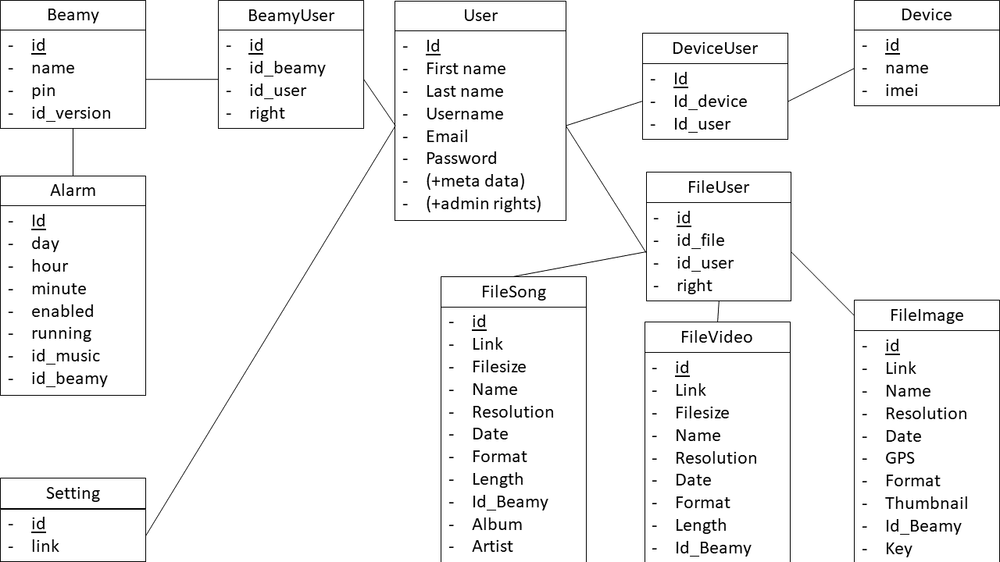

# Getting started

## Table of contents

* [Setup Django for developpement testing](#setup-django-for-developpement-testing)
* [Comments](#comments)

## Setup Django for developpement testing

First make sure to install properly `python 3.6.4` and `Django 2.0`. The procedure varies depending on your operating system.<br>Be sure to also install `lxml 4.1.1` for python. The easiest way is to install `pip` and run `pip install lxml==4.1.1`.

Clone/pull/download the repo.

Go to the project root directory.

Synchronize the databases

```sh
python manage.py migrate
```

Create a `superuser` account to acces the admin page

```sh
python manage.py createsuperuser # only before first run
```

Run the server

```sh
python manage.py runserver 0.0.0.0:8000
```

> NB : on linux systems, use `python3/pip3` instead of `python/pip`.

> NB : the server can't be deployed in production right away. Some security precautions are to be taken. Use these instruction only for testing purposes.

## Database

We have implemented the database using the default `sqlite3` server.

The current state of the tables is shown in the image below. The `User` table is different as we didn't implement it ourself. It is managed by default by Django. All other tables are defined in `/back/BDD/models.py`.



## Comments

Timezones are not yet well managed. We need to make sure each alarm rings at the right time in the right timezone.
For example, we live in `Europe/Paris` but Django default timezone is `UTC`.